# Art by Nat

Art by Nat is a website created for a potential client to see the painter's work. The main purpose of the site is to present her paintings, and the possibility of ordering your own.
The site will allow new and returning users to view the artist's work and get in touch.

The website is fully responsive and was designed using HTML, CSS and User Centric Design modules.

[View the live site](https://monimaj89.github.io/Project1/)

***
# Contents

* [User Experience (UX)](#user-experience-ux)
    * [Project Goals](#project-goals)
        * [User Goals](#user-goals)
        * [Site Owner Goals](#site-owner-goals)
        * [User Expectactions](#user-expectactions)
    * [User Stories](#user-stories) 
        * [As i first time user](#as-a-first-time-user)
        * [As a returning user](#as-a-returning-user)
        * [As a site owner](#as-a-site-owner)
* [Design](#design)
    * [Colour](#colour)
    * [Typography](#typography)
    * [Icons and Images](#icons-and-images)
    * [Wireframes](#wireframes)
* [Features](#features)
    * [Favivon](#favicon)
    * [Header](#header)
    * [Navigation bar](#navigation-bar)
    * [Hero Image](#hero-image)
    * [About me & quote section](#about-me--quote-section)
    * [A carousel & quote section](#a-carousel--quote-section)
    * [Footer](#footer)
    * [Gallery Page](#gallery-page)
    * [Contact Page](#contact-page)
* [Technologies](#technologies-used)
* [Testing](#testing)
    * [Validator Testing](#validator-testing)
        * [HTML](#html)
        * [CSS](#css)
    * [Wave Testing](#wave-testing)
    * [Lighthouse Testing](#lighthouse-testing)
    * [User Testing](#user-testing)
* [Bugs](#bugs)
* [Deployment](#deployment)
* [Credits](#credits)

# User Experience (UX)
## Project Goals
### User Goals:
* Find reliable information about the painter
* View the gallery
* Get in touch through contact form and social media

### Site Owner Goals:
* Provide essential information about the painter
* Allow customer to view the paintings
* Provide easy way to get in touch

### User Expectactions
* An easy and intuitive navigation system
* An easy access to any information
* Links that work as expected
* Every page accessible regardless of screen size
* A simple contact form
* Confirmation of received query

## User Stories

### As a first time user:
* I want to know the purpose of the website
* I want to easily navigate throughout the website
* I want to be able view the website on mobile device
* I want to follow the painter on social media

### As a returning user:
* I want to see what the painter has to offer
* I want to be able to easily contact the painter
* I want to see frequently updated gallery

### As a site owner:
* I want customers to get to know me
* I want customers to know what I can offer
* I want customers to easily contact me
* I want customers to be able to follow me on social media

# Design
## Colour
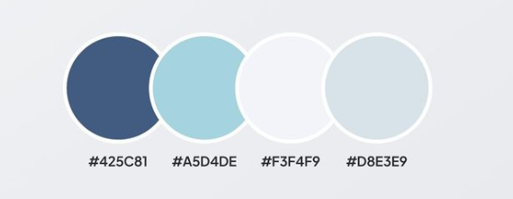

The colour palette is a shade of blue. The main site colour is #a5d4de which was used for a header, navigation bar and a footer background, as well as for a website background color with a nice white-blue gradient. Darker blue #425c81 used in details like buttons' background and social media icons. The lighter colours were used for the hero image, 'About me' text paragraph and buttons. Additionally dark blue #2d3436 was used for the main header, and navigation bar.

## Typography
Fonts were imported from [Google Fonts](https://fonts.google.com/). 

* 'Great Vibes' font is used for a main header. It is a chic and elegant font which adds an element of artistry to the site.

  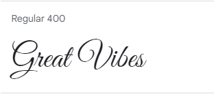

* 'Spectral' is the font used for a hero image and 'About me' header. I choose slightly italic version of this font which is beautiful and efficient design.

  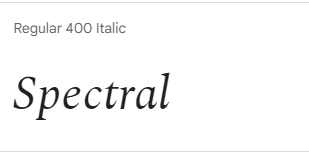

* The main body font is 'Lato'. This font is unique and interesting but simple at the same time. The letters in 'Lato' have some unique curves which are a great match to the artistic side of the page.

  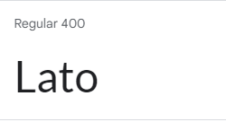

* Sans serif is set as a backup if any of the fonts fail to load.
## Icons and Images
1. Icons were sourced from [FontAwesome](https://fontawesome.com/). 
* The palette icon was selected to perfectly match the theme of the site. It has also been enlarged to fit the header.

  

* The social media icons were selected to be easily understable and accessible for every user.

  

2. Images 
* Home page images like the hero image, and quote image were borrowed from [Pexel](https://www.pexels.com/)
* Images from carousel and gallery are paintings made and owned by my sister Natalia Michalska and were provided for this website.
## Wireframes
Wireframes were created at the beginning of the design process using [Balsamiq](https://balsamiq.com/wireframes/desktop/). 

* Home Page

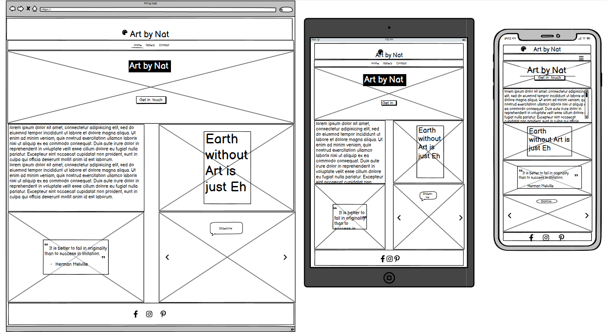

* Gallery

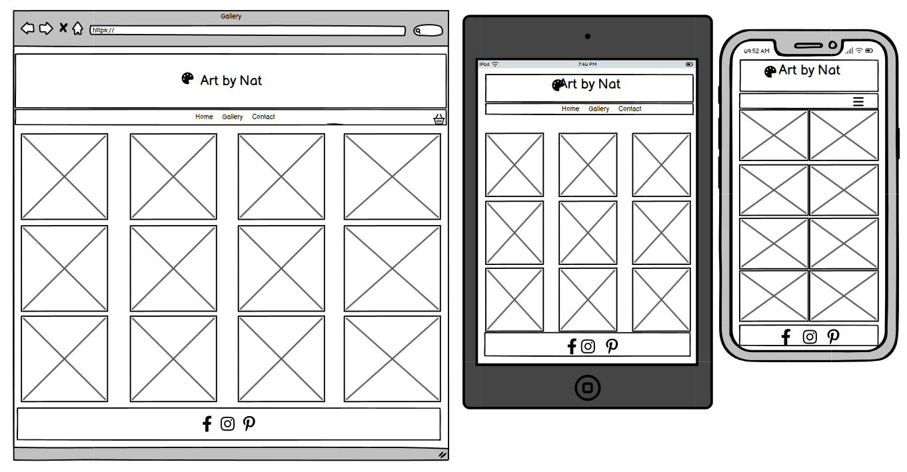

* Contact page

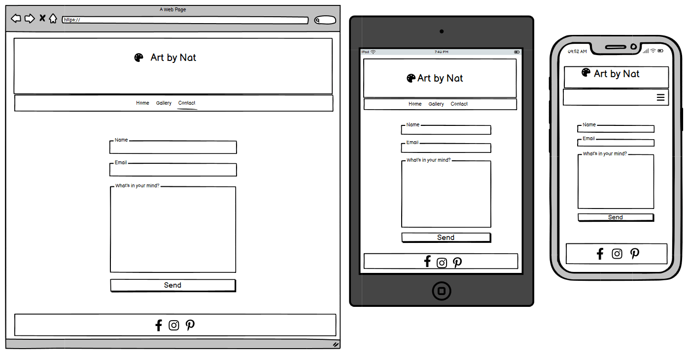

# Features 
## Favicon
* Paint palette [Favicon](https://favicon.io/) 
* Make the tab stands out among others and allow users easily revisit the page.

  

## Header
* A simple text decorated with palette icon. 
* Repeated on all three pages and when clicked redirects back to the home page.

  

## Navigation bar
* Contains home page, gallery and contact. 
* Highlighted active page. 
* Upon hovering over the individual links become darker. 
* Fully responsive, which means that it will turn into a hamburger on a smaller screen.

  
  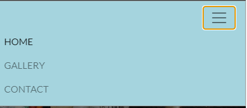

## Hero Image
* Includes an image of a painter's toolbox.
* Contains:
  * A clear page title.
  * A link redirecting to the contact page.

  

## About me & quote section
* Contains 'About me' paragraph, with a few sentences about painter's life, education and inspirations.
* A decorative art quote with skyish background.

  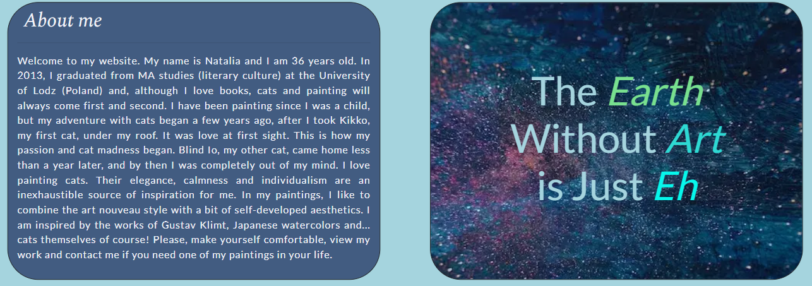

## A carousel & quote section
* Includes a Herman Melville's art quote with a background image.
* A carousel gallery with 4 images which change automatically.  

  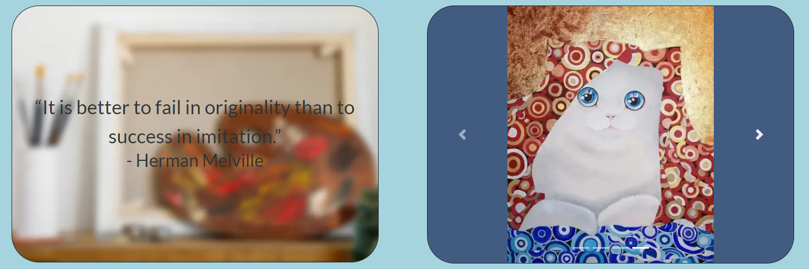

## Footer
* Simple and neat design matches header.
* Includes links to the social media sites. 
* The links will open to a new tab to allow easy navigation for the user.

  

## Gallery Page
* Contains a twelve paintings, which will allow user to get acquainted with the painter's style.
* Gallery is fully responsive and accessible on every devices.

  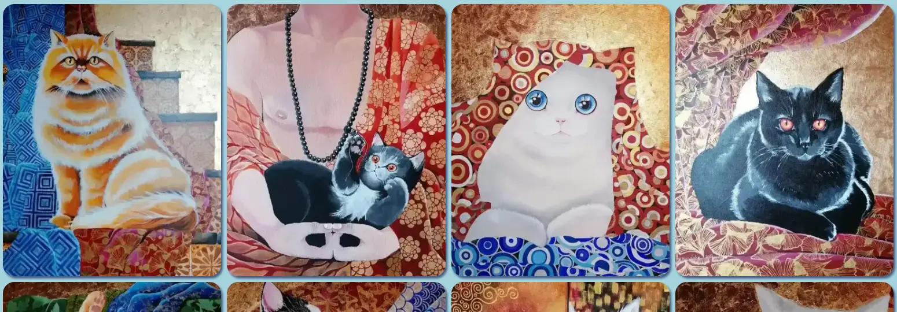

## Contact Page
* Contact form enables to get in touch with the artist. The form includes:
  * Name (type=text, required)
  * Email (type=email, required)
  * Project description (type=textarea, required)
* After correctly completing and sending the form, the user will be redirected to the 'thank you' page.

  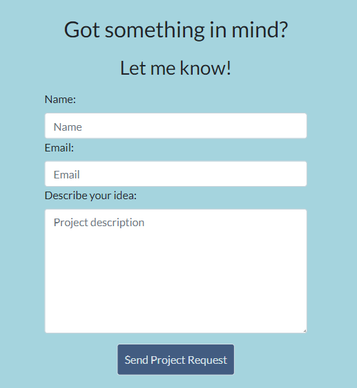
  

# Technologies used
  * Languages
    * The structure of website was developed using HTML as the main language.
    * The Website was styled using custom CSS in an external file.
  * Framework
    * Bootstrap v 4.5
  * Tools
    * GitHub - source code is hosted and deployed using Git Pages.
    * Git - used to commit and push code during the development off the Website.
    * Google Chrome Developer Tools was used for debugging and testing with Lighthouse.
    * [Google Fonts](https://fonts.google.com/) - used to import fonts for use in the site.
    * [Font Awesome](https://fontawesome.com/) - used for icons.
    * [Tinyjpg](https://tinypng.com/) was used to reduce the size of the images used throughout the website.
    * [Cloud Convert](https://cloudconvert.com/) - used to convert images into webp.
    * [Favicon](https://favicon.io/) - used for a browser tab icon.
    * [Balsamiq](https://balsamiq.com/wireframes/desktop/) - used to create wireframes.
    * [Mockup Generator](https://techsini.com/multi-mockup/) - used to create mockup image.
  
# Testing
## Validator Testing
### HTML
* All four pages were tested using the [W3C Validator](https://validator.w3.org/).
* On the gallery page one [warning](assets/images/readme-img/warning.PNG) was found.
It was fixed by changing section element to div element.
  * [Home Page](assets/images/readme-img/homecheck.PNG)
  * [Gallery Page](assets/images/readme-img/gallerycheck.PNG)
  * [Contact Page](assets/images/readme-img/contactcheck.PNG)
  * [Thank you Page](assets/images/readme-img/thankyoucheck.PNG)
### CSS
  * [CSS Validator](https://jigsaw.w3.org/css-validator/) were used to test the CSS, and shows no errors.
  * [CSS Check](assets/images/readme-img/csscheck.PNG)

## Wave Testing
* Each page was run through the Web Accessibility Evaluation Tool [Wave](https://wave.webaim.org/), the initial report showed a few needs for improvement:
  * A heading size was skipped (i.e. there was not a h2), so the h3’s were changed to h2’s on the hero image.
  * The background on the 'About me' paragraph was changed to darker to increase contrast ratio.
  * Screen reader only information  were added for social media icons.
  * Gallery images size were reduced.
* There were still two alerts presented on each page which were ignored as I believe they were significant to the page design:
  * Redundant link - the Contact button on the Hero image and the Contact link on the navigation bar, which I decided to keep, to give users two options to navigate to the contact form.
  * Justified text in the paragraph - it may have negative impact for readability, but I believe justified test looks clean, it is even more readable and clear.
* Score of each pages:
  * [Home Page](assets/images/readme-img/homewave.PNG)
  * [Gallery Page](assets/images/readme-img/gallerywave.PNG)
  * [Contact Page](assets/images/readme-img/contactwave.PNG)
  * [Thank you Page](assets/images/readme-img/thankyouwave.PNG)

## Lighthouse Testing
### Lighthouse testing was performed using [Google Chrome Lighthouse](https://chrome.google.com/webstore/detail/lighthouse/blipmdconlkpinefehnmjammfjpmpbjk) extension.
* Desktop
  * [Home Page](assets/images/readme-img/hemodes.PNG)
  * [Gallery Page](assets/images/readme-img/gallerydes.PNG)
  * [Contact Page](assets/images/readme-img/contactdes.PNG)
  * [Thank you Page](assets/images/readme-img/thankyoudes.PNG)
* Mobile
  * [Home Page](assets/images/readme-img/homeperf.PNG)
  * [Gallery Page](assets/images/readme-img/galleryperf.PNG)
  * [Contact Page](assets/images/readme-img/contactperf.PNG)
  * [Thank you Page](assets/images/readme-img/thankyouperf.PNG)

### Improvements to the Lighthouse score:

* Converted all images into webp format and compressed sizes to speed up loading times.
* Placed all scripts files into bottom of the body rather than in the head, so most important content was loaded first.

## User Testing
|   Target      |   Outcome     | Image |
| ------------- |-------------| -----------|
| 1. Header navigates to main page.  | The header is clickable and will redirect to the home page from any other page. |  |
| 2. Easy and clear navigation throught all pages.|Navbar is conveniently located at the top of every page and the links are clearly visible. Each link navigates to the correct page. Users are already familiar with the hamburger menu, so they will know its functions. |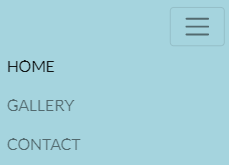 |
| 3. Easy contact. | Additionally added in the center of the hero image contact button, which will navigate to the contact page. |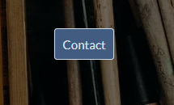 |
| 4. Get in touch through social media.  |Font Awesome social media icons placed in the footer, each one opens in a new tab, and has a hover effect.| |
| 5. Acknowledgement that the query has been received. | After submiting the query, user is directed to the 'Thank you' page, acknowledging their query has been received |  |
| 6. Being able to visit site on every device. | The page has been designed responsively (including using a hamburger navbar) to ensure the site is accessible on any device. Content changes to displaying two items in one line in desktop, to displaying one per line on mobile. |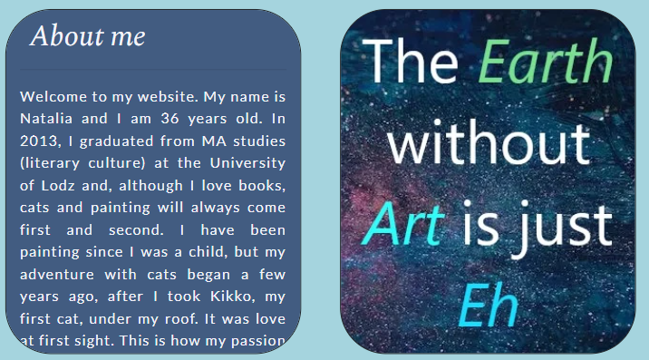 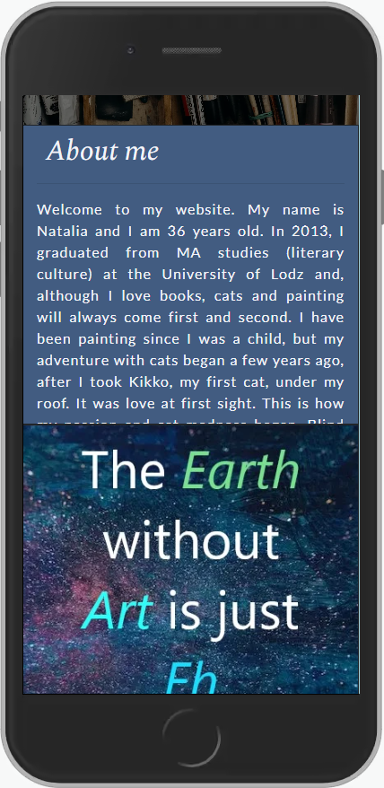 |

# Bugs
| Bugs       | Solved?   | How? |
|------------|-----------|------|
| 1. Footer on the contact page  | Yes | The page did not have enough content, so the footer was displayed in the middle of the page. I found solution on the [CSS Tricks Page](https://css-tricks.com/couple-takes-sticky-footer/). |
| 2. Carousel images on the desktops were too stretched and didn't look good. | Yes    |   I've asked for help on the [stack overflow](https://stackoverflow.com/) and was advised to add object-fit: contain property to my CSS, which centered images and make them look better. |
| 3. Images not displaying on my home page | Yes | I've changed absolute file path to the relative path. |
| 4. On the landscape view, the text on the quote overflows the image. [See here](assets/images/readme-img/bug.PNG) | Yes | I've added position: relative to the parent, and absolute to the child.

# Deployment
### The following steps were taken to deploy the website on GitHub Pages:

1. The Code Insitute template was obtained from https://github.com/Code-Institute-Org/gitpod-full-template
2. A new repository was created in GitHub, the project was named.
3. The green Gitpod button was pressed to open a new workspace/development environment (obtain the gitpod extension to enable the green button).
4. Git is used to commit during development and push this over to Github
5. To create the hosted site at Github Pages, I navigated to the Github repo settings tab and found the Github pages dedicated section.
6. The main branch was chosen in the dropdown menu and the 'save' button was pressed. This supplied a live link to the [website](https://monimaj89.github.io/Project1/).

### To run locally
1. Go to the Github repo at https://github.com/monimaj89/Project1.
2. Click on the 'code' button and copy HTTPS link.
3. Open your own terminal in your editor and change the current working directory to the location of where you want the cloned directory to be.
4. In the terminal type git clone, and then paste the URL you copied.
5. Press enter to complete.

### You can fork the repository by following these steps:

1. Go to the GitHub repository
2. Click on Fork button in upper right hand corner

# Credits
1. Code Institute - It was a pure pleasure to learn HTML, CSS, use of the Bootstrap, and Gitpod with Code Institute. Participating in the course allows me to develop my programming skills. The idea of the hamburger menu was borrowe from Bootstrap mini project: Whiskey Drop.
2. Gareth McGirr - my menthor, who were always helpful.
3. My sister, Natalia Michalska, who gave me idea for this page, provided gallery images and "About me" text.
4. Slack community - Their help was invaluable.
5. Images on the home page were downloaded from [Pexel](https://www.pexels.com/)
* [Hero image by Cottonbro studio ](https://www.pexels.com/photo/assorted-color-paint-brush-set-3777876/)
* [Quote background by Suzy Hazelwood](https://www.pexels.com/photo/blue-and-red-galaxy-artwork-1629236/)
* [Quote 2 background by Cup of Couple](https://www.pexels.com/photo/art-materials-over-a-wooden-chair-7301927/)

